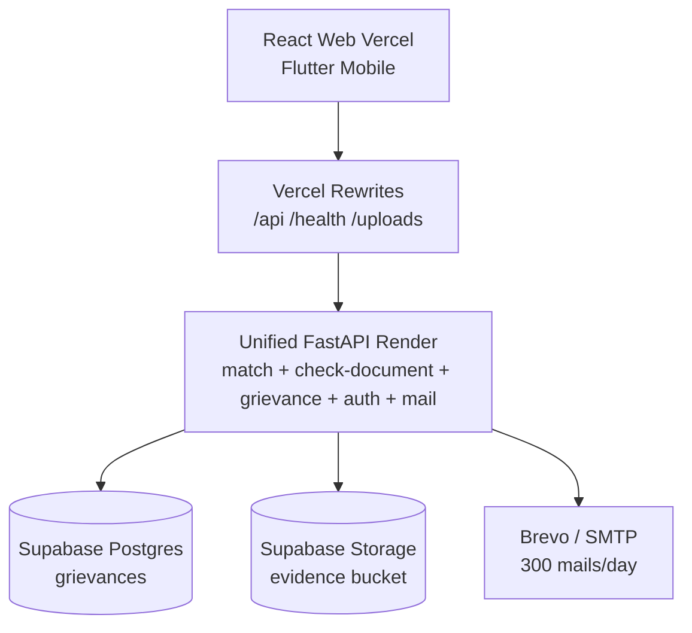

# Document 2 — Solution Presentation (Slide Deck Source)
### Samarth Yojana • MPOnline | 6 Slides, 16:9 | Export this file to PDF as Document 2

> How to use: paste the PROMPT block into Gamma / Beautiful.ai / Canva AI / ChatGPT+Designer to auto-generate visuals. Then export as PDF (max 1MB). This .md itself is the text backup if PDF builder is unavailable.

---

## COPY-PASTE PROMPT FOR SLIDE BUILDER (LLM)

```
Build a 6-slide, 16:9 hackathon pitch deck for "Samarth Yojana — MPOnline",
citizen grievance-redressal + welfare-scheme portal for Madhya Pradesh
(MPOnline Idea & Innovation Hackathon 2026, Challenge 5). Team: [TEAM NAMES].

DESIGN: deep-ink navy #0B1026 → indigo #1E1B4B gradients, saffron #F59E0B accents,
white cards 20px radius soft shadows, Inter/Outfit bold headings, max 5 bullets/slide,
one hero visual per slide. Confident, civic, demo-driven. No clip-art.

SLIDE 1 — Title: "Samarth Yojana • MPOnline" + "Every complaint tracked. Every scheme
within reach." + badges: CM Helpline 181 / 3-Tier SLA / 13+ Schemes / ₹0 Free-Tier Cloud.
Footer: Hackathon 2026 • Challenge 5 • [TEAM]. Background: dark gradient + faint MP map watermark.

SLIDE 2 — Problem→Solution split. LEFT red: confusing eligibility, complaints die in registers,
duplicate paper reports. RIGHT emerald: (1) multimodal filing text/voice/photo auto-triaged
to 5 depts, (2) 3-tier escalation L1 7d → L2 3d → L3 1d + immutable timeline + real email,
(3) mobile tracking zero login, (4) rule-based matcher + OCR pre-screen. Thread: Ramesh's
soybean-mandi road in Sehore with pothole photo.

SLIDE 3 — Grievance swimlane (centerpiece). Lanes: CITIZEN / SYSTEM (AI+rules) / AUTHORITY TIERS.
Flow: File (AI confidence %, <75% human review) → dedup (≥3-keyword merge) → 7d SLA →
L1 act → breach → L2 Collector + show-cause → L3 CMO → Resolved + note + evidence.
Annotate: every transition = real email + timeline stage. Colors: sky/violet/blue/amber/rose.

SLIDE 4 — Layered deployment: CLIENTS (React+Vite+Tailwind Vercel, Flutter) → EDGE (Vercel rewrites)
→ ONE FastAPI Render free: rule engine, OCR+vision transient DPDP, grievance+SLA, auth, Brevo →
DATA: Supabase Postgres + Storage evidence bucket + Brevo 300/day. Label endpoints:
POST /api/grievance/submit, /{id}/escalate, /{id}/status, GET /by-mobile/{n}, POST /api/match,
POST /api/check-document. Callout: "Why one service: free tier, zero hops, one pipeline."

SLIDE 5 — Stack table choice→reason + ops strip "₹0/month — Render $0 + Vercel $0 + Supabase $0 +
Brevo $0. Limit: Render sleeps 15min → Wake button polls /health."

SLIDE 6 — Live proof + ask. Left: 60-sec demo script. Right: impact + roadmap (GPS pins, SMS/IVR,
collector analytics) + "Justice delayed is justice denied — we put a clock on it." + QR to live site.
Also generate speaker notes 30-45s/slide.
```

## Slide Outline (Text Version for PDF Export)

**Slide 1 — Title:** Samarth Yojana • MPOnline / tagline / badges / team
**Slide 2 — Problem → Solution:** pain vs 4-point solution + Ramesh example
**Slide 3 — Workflow:** A complaint can never die quietly (see Doc 7 Mermaid)
**Slide 4 — Architecture:** one service, free tier, endpoint labels
**Slide 5 — Stack & Cost:** table + ₹0 math + wake-button note
**Slide 6 — Demo & Ask:** 60-sec script + impact + roadmap + QR placeholder

## Speaker Notes (30s each)

1. MP citizens miss benefits + complaints vanish — we fix both.
2. Confusing rules + dead registers → structured matcher + clocked grievance.
3. Every complaint gets ID, clock, owner; duplicates add weight.
4. One backend fits free tier, no hops, contract unchanged.
5. Deterministic core, LLM only explains; honest verdicts; zero storage.
6. Live filing → tracking → escalation + email + heatmap. Thank you.

## Mermaid for Slide 4 (paste into Mermaid.live if builder needs diagram)


