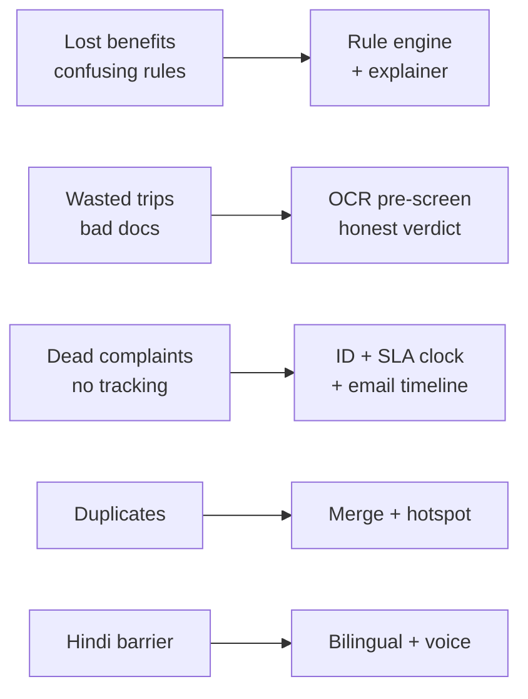

# Document 3 — Problem Statement & Proposed Solution

## 1. Challenge Context

MPOnline Idea & Innovation Hackathon 2026, Challenge 5: AI Innovation for Public Services & Citizen-Centric Governance. Domains: education/scholarship, women-child welfare, skill-employment, healthcare, grievance redressal.

## 2. Problem Statement (Evidence-Based)

**P1 — Citizens lose entitled benefits:**
13+ schemes with hidden traps: MMVY needs 70-75% (MP Board) / 85% (CBSE), Vikramaditya General-only + ₹54k income, Ladli Laxmi requires registration within 1 year of birth (older unregistered girls ineligible forever), Ladli Behna Awas requires already being Ladli Behna beneficiary + kutcha house + PMAY exclusion, Sambal requires parent's unorganised-worker registration. Citizens learn this only at kiosk after travel + wage loss.

**P2 — Complaints die quietly:**
No tracking ID, no SLA, no proof, duplicate paper reports, no district-load view. CM Helpline 181 overloaded. Officials drown in duplicates.

**P3 — Access barrier:**
Hindi-first rural users, low digital literacy, phone-first, venue Wi-Fi unreliable. Chatbots hallucinate and confuse.

## 3. Proposed Solution

**Track A — Scheme Assistant (Yojana Sathi):**
8-question structured form (not open chat) → rule engine `evaluate_all()` in `backend/matcher.py` → `matches` + `possible_but_unconfirmed` + `missing_info_that_would_help` → bilingual explainer `backend/explainer.py` (LLM explains only, 8s timeout + templated fallback) → SchemeCard with benefits, document checklist, official portal link, disclaimer → per-document photo pre-screen `backend/ocr.py` + `backend/vision_check.py` → verdict `likely_acceptable / needs_review / likely_wrong_document`.

**Track B — Grievance Portal (Samarth Yojana):**
File (title, description, district, dept override, mobile, photo, voice transcript) → `classify_grievance()` keyword triage over 5 depts with rural/urban + critical-trigger boost, user selection wins 0.97 confidence, <75% parks at L0 human review → `check_deduplication()` ≥3-keyword merge + co-complainant counter → 7-day L1 clock → `escalate_grievance()` L2 (3d) → L3 (1d) with real email + immutable timeline → `resolve_grievance()` with officer note + evidence. Track via `/track/{id}` or `/by-mobile/{n}`. Heatmap + district cards via `get_hotspot_analytics()`.

## 4. Why This Genuinely Solves It

| Problem | Fix | Proof |
|---|---|---|
| Confusing cutoffs | Deterministic rules, MMVY 65% correctly rejected | test_personas pass |
| Hidden prerequisites | Explicit follow-up questions, never assume | Ladli Behna Awas logic |
| Wasted trips | Legibility/type/validity flags pre-visit | OCR + vision |
| Lost complaints | ID + clock + owner + email log | Dossier view |
| Duplicates | Merge + hotspot weight | Heatmap lights up |
| Language | EN/HI toggle, voice hi-IN/en-IN | `t/S` pattern |

## 5. Non-Goals (Honest Scope)

No ML training, no Samagra/e-KYC/DigiLocker integration claim, no invented schemes (dataset only source of truth), no citizen accounts or document storage beyond session, no open-chat NLU. Decision support, not sanction — only officials approve.

## 6. Mermaid — Problem → Solution Map

### LLM Prompt to Regenerate This Diagram

> Generate a Mermaid flowchart LR showing 5 problem nodes (P1-P5) on left in red tones linking to 5 solution nodes (S1-S5) in green tones for an MP e-governance hackathon. Labels: P1 Lost benefits, P2 Wasted trips, P3 Dead complaints, P4 Duplicates, P5 Hindi barrier; S1 Rule engine, S2 OCR pre-screen, S3 ID+SLA+email, S4 Merge+hotspot, S5 Bilingual+voice. Minimal, high-contrast, suitable for PDF export.
