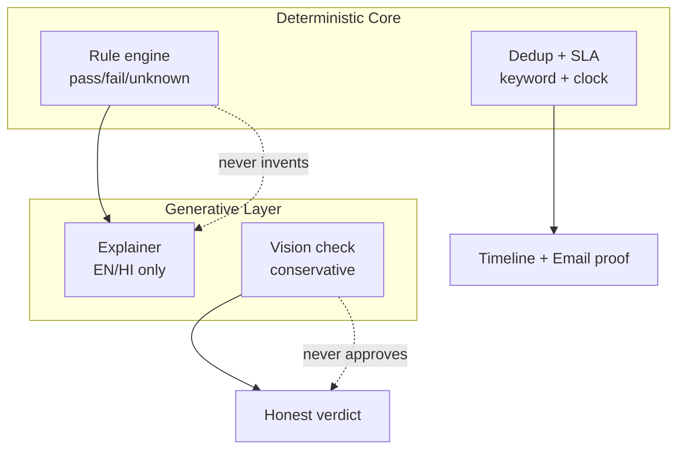

# Document 4 — Innovation & Differentiation Note

## 1. What Is Innovative (Not a CRUD Portal)

**1. Zero-hallucination split:** `backend/matcher.py` (pure Python, no LLM) decides; `backend/explainer.py` (single Claude wrapper `backend/llm_client.py`) only verbalises. System prompt: "Only explain the match already determined; do not introduce new eligibility claims." 8s timeout + templated fallback keeps UI alive offline.

**2. Conservative document AI:** Vision prompt prefers `needs_review` over `likely_acceptable` when unsure; forbids fabricating certificate numbers/names/dates. Adversarial test (laptop photo → `likely_wrong_document`) in `services/document/tests/test_document.py`.

**3. Complaint can never die quietly:** Deduplication (same district/dept + ≥3 keyword overlap → parent + counter), hotspot scoring, SLA auto-escalation with show-cause, append-only timeline (`immutable: true`), resolved tickets cannot reopen from desk.

**4. Server-enforced isolation:** `GET /api/grievance/list` with L1 token and no desk returns zero rows (`backend/main.py:505`). L2/L3 bypass for state monitoring. Not just UI filtering.

**5. Free-tier systems engineering:** 3 services merged to 1 to fit Render free single-service; in-process matching + OCR kills network hops; Vercel rewrites hide origin; Supabase Postgres + Storage `evidence` bucket survives ephemeral disk; Brevo 300/day with Gmail SMTP fallback; Wake button polls `/health` 12×/8s to recover from 15-min sleep.

**6. Keyless civic UX:** Leaflet + CARTO/OSM heat (50+ MP district centroids, severity-weighted glow, filters, zoom 5–12), Web Speech API hi-IN/en-IN + MediaRecorder clips with graceful degrade, central `t/S` bilingual pattern (e.g. खुला/समीक्षाधीन/कार्रवाई जारी/निराकृत).

**7. Tricky-rule modelling:** MMVY merit cutoff, Sambal parent-registration, Ladli Laxmi infant-window, Ladli Behna Awas dependency chain modelled as hard disqualifiers + explicit follow-up prompts, covered by expanded `test_personas`.

## 2. Differentiation vs Alternatives

| Alternative | Gap | Our edge |
|---|---|---|
| Chatbot scheme finder | Hallucinates cutoffs | Deterministic + cited dataset |
| myscheme.gov.in list | No personalised why, English-heavy | Plain Hindi why + missing-info |
| CM Helpline register | No public dossier/proof | ID + timeline + email log + heatmap |
| Generic grievance form | Silent misroute | 75% human-review fallback + override |

## 3. Mermaid — Innovation Stack

### LLM Prompt to Rebuild This Visual

> Create a Mermaid flowchart TB with two subgraphs: Deterministic Core (Rule engine, Dedup+SLA) in blue and Generative Layer (Explainer, Vision check) in violet, both feeding Timeline+Email proof and Honest verdict boxes in emerald. Add dashed annotations never invents / never approves. Clean, minimal, white background for PDF.
