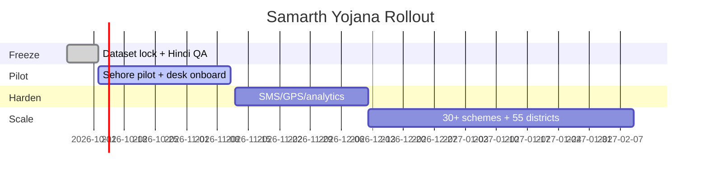

# Document 6 — Implementation / Feasibility Plan

## 1. Current Readiness (MVP Live)

- Unified API live: `https://yojana-sathi-api-orro.onrender.com` (`/health` → schemes_count 13, `/api/db/status`, `/api/email/status`).
- Frontend Vercel + local `run_local.ps1` / `run_local.sh` (5173 + 8000). Docker Compose fallback (`docker-compose.yml`).
- Seeds SD001–SD006; roles RAM-L1 / Shyam-L2 / Jay-L3; 5 departments in `backend/auth.py`.
- Tests green: `pytest backend/tests/test_unified.py`, `services/eligibility/tests/test_matcher.py`, `services/document/tests/test_document.py`.

## 2. Deployment (Proven)

`render.yaml`: 1 free Python service, `rootDir: backend`, build `pip install -r requirements.txt`, start `uvicorn main:app --host 0.0.0.0 --port $PORT`, health `/health`. Secrets (`SUPABASE_*`, `BREVO_*`, `ANTHROPIC_API_KEY`) in dashboard, never committed. `frontend/vercel.json` rewrites `/api,/health,/uploads` to API origin. Supabase schema in `backend/supabase_schema.sql`.

## 3. Phased Rollout

**Phase 0 — Freeze (Week 1):** Lock 13-scheme JSON with citations, Hindi QA, caps (doc 5MB JPG/PNG/WebP, grievance photo 4MB), rate limit 60/min.
**Phase 1 — Pilot (Month 1–2):** 1 district (Sehore/Bhopal), onboard L1 desks, verify Brevo sender, custom domain for deliverability, train helpdesk on 90-sec demo script.
**Phase 2 — Harden (Month 2–3):** SMS/IVR updates, GPS-tagged pins, collector analytics export, OTR/NSP deep-links.
**Phase 3 — Scale (Month 3–6):** 30+ schemes via same JSON schema, district-wise heatmap SLA reports, PWA offline form.

## 4. Resources

2–4 devs, no paid infra, no GPU. Env template in `.env.example`. Venue fallback needs no Docker.

## 5. Risks & Mitigations

| Risk | Mitigation |
|---|---|
| Render sleeps 15min | Wake button 12×/8s poll + status dot |
| LLM/API down | Rule-only fallback, templated reasons |
| Mis-triage | <75% human review queue + user override |
| Wrong doc verdict | Conservative `needs_review`, never approved |
| Email spam-folder | Verified sender + custom domain roadmap |
| Data loss on redeploy | Supabase + local JSON mirror, fixed IDs |

## 6. Mermaid — Rollout Timeline

### LLM Prompt to Rebuild Timeline

> Generate a Mermaid gantt chart titled Samarth Yojana Rollout with 4 sections Freeze/Pilot/Harden/Scale spanning Oct 2026–Feb 2027. Tasks: Dataset lock 7d, Sehore pilot 30d, SMS/GPS/analytics 30d, 30+ schemes 60d. Clean monochrome suitable for PDF, no screenshots.
