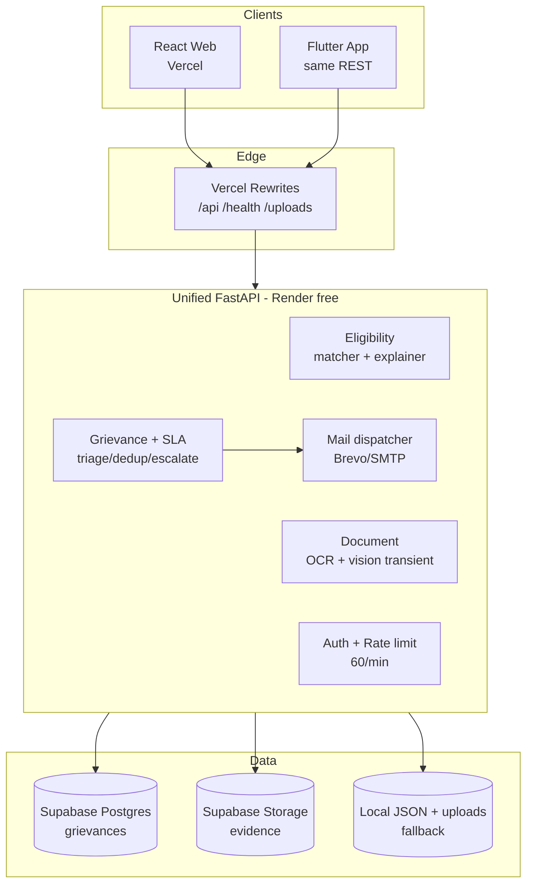
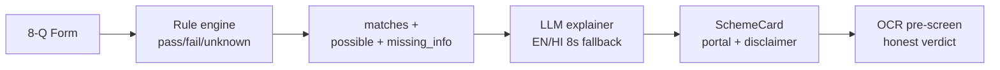

# Document 7 — Technology Architecture / Technical Approach

## 1. Overview

One unified FastAPI service + React/Flutter clients + managed free-tier data/mail. Legacy 3-service layout (`services/gateway,eligibility,document`) kept for reference; all dev/deploy uses `backend/` in-process to fit Render free tier with zero inter-service hops.

## 2. Layered Architecture

```
CLIENTS: React 18 + Vite 6 + Tailwind 3 (Vercel) | Flutter (same REST)
  → EDGE: Vercel rewrites /api /health /uploads → https://yojana-sathi-api-orro.onrender.com
  → API: FastAPI + Pydantic v2 (backend/main.py, backend/schemas.py)
      → Eligibility: matcher.py evaluate_all() + explainer.py explain_matches() + llm_client.py
      → Document: ocr.py extract_text_from_image() + vision_check.py check_document_readiness()
      → Grievance: grievance_engine.py (classify, dedup, escalate, hotspot) + auth.py + db.py
      → Mail/Store: email_service.py (Brevo→SMTP) + object_store.py (Supabase Storage)
  → DATA: Supabase Postgres grievances (indexed dept/district/level/status/mobile + JSONB data)
          + Storage evidence bucket + local backend/uploads/ + backend/data/grievances.json mirror
```

## 3. Key Design Decisions

- **FastAPI + Pydantic:** Typed contracts (`MatchRequest/Response`, `GrievanceSubmitRequest/Response`, `DocumentCheckResponse`) caught a real py3.12-only NameError pre-deploy.
- **Rule-first AI:** Matcher soft-filters pass/fail/unknown; hard disqualifiers (Ladli Laxmi window, Awas dependency) explicitly fail. LLM never re-decides.
- **Transient docs:** OCR bytes in memory, `del contents` after response; grievance evidence only persisted file (consented proof).
- **Email truth:** Every send/failure appended as EMAIL_SENT/FAILED with provider + message ID; verifiable via `/api/email/test`.
- **Auth:** Seeded RAM/Shyam/Jay, token = email lowercased, L1 desk isolation server-side.
- **Resilience:** 60 req/min per-IP, 4–5MB caps, allow-list JPG/PNG/WebP, dataset loader probes 6 paths, `/health/all` reports all modules.

## 4. API Surface

Eligibility `POST /api/match` (+ alias `/match`); Docs `POST /api/check-document`; Grievance `POST /api/grievance/submit`, `GET /list`, `GET /track/{id}`, `GET /by-mobile/{n}`, `POST /{id}/escalate|status|request-approval|approval-decision|resolve`, `POST /api/grievance/upload-photo`; Auth `POST /api/auth/login`; Meta `GET /api/departments`, `/api/authority-levels`, `/api/email/status|test`, `/api/db/status`; Health `/health`, `/health/all`.

## 5. Scalability & Security

Stateless API, indexed queries, local mirror, free-tier horizontal scale. No `VITE_*` secrets in browser. Secrets only on Render. DPDP: no citizen accounts, no tracking, docs discarded. Append-only audit, resolved immutable.

## 6. Mermaid Diagrams

### 6A. System Architecture (use for submission PDF)



### 6B. Grievance Sequence

```mermaid
sequenceDiagram
  participant C as Citizen
  participant S as System AI+Rules
  participant L1 as L1 Desk 7d
  participant L2 as Collector 3d
  participant L3 as CMO 1d
  C->>S: submit + photo/voice + mobile
  S->>S: triage conf%<br/>&lt;75% human review
  S->>S: dedup ≥3 keywords
  S->>L1: route + email + timeline
  L1->>L1: in_review/in_progress
  alt SLA breach
    S->>L2: escalate + show-cause + email
    L2->>L3: forward + email
  end
  L1-->>C: resolve + note + email
  L2-->>C: resolve + note + email
  L3-->>C: resolve + note + email
```

### 6C. Eligibility Flow



### LLM Prompt to Regenerate Architecture Neatly

> Generate three Mermaid diagrams for an MP e-governance hackathon PDF (white background, high contrast, no emojis):
> 1) flowchart TB layered deployment: Clients (React Vercel, Flutter) → Edge (Vercel rewrites) → API (Eligibility, Document transient, Grievance+SLA, Auth 60/min, Mail Brevo) → Data (Supabase Postgres, Storage evidence, Local fallback). Use subgraphs with distinct pastel fills.
> 2) sequenceDiagram Citizen→System→L1→L2→L3 with triage <75% human review, dedup, SLA breach escalation, resolve emails.
> 3) flowchart LR form→rule engine→matches→LLM explainer→SchemeCard→OCR. Keep labels short, export-safe fonts. Return only Mermaid code blocks.
